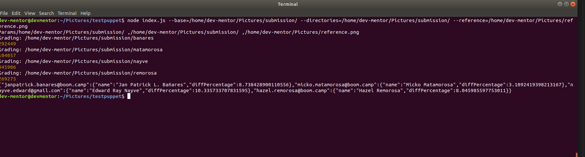

## Install
```
cd testpuppet
npm install
```
## Execute

```
node index.js --base=/home/dev-mentor/Pictures/scrap-example/submission/ --directories=/home/dev-mentor/Pictures/scrap-example/submission/ --reference=/home/dev-mentor/Pictures/scrap-example/reference.png
```

## Change
Change this = `/home/dev-mentor/Pictures/`


### What we need to achieve:


